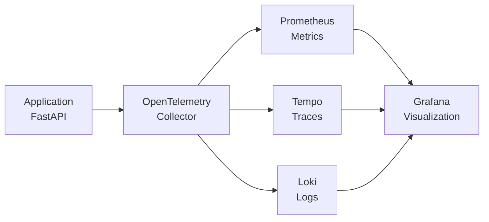

# OpenTelemetry MVP with Full Observability Stack

## General Overview

This project is an MVP (Minimum Viable Product) demonstrating OpenTelemetry integration with a full observability stack. It showcases how to instrument a FastAPI application to generate telemetry data (traces, metrics, and logs) and route it through an OpenTelemetry Collector to various backends for monitoring and visualization.

The stack includes:

- **Loki** for centralized logging
- **Grafana** for dashboards and visualization
- **Tempo** for distributed tracing
- **Prometheus** for metrics collection

The core application is a FastAPI service that generates sample telemetry data, simulating real-world observability scenarios.

## High-Level Design Document

### Architecture Overview

The system follows a microservices architecture with the following components:

- **Application (FastAPI)**: The main service instrumented with OpenTelemetry for automatic generation of traces, metrics, and logs
- **OpenTelemetry Collector**: Receives OTLP (OpenTelemetry Protocol) data from the application and routes it to appropriate backends
- **Backends**:
  - **Prometheus**: Stores and serves metrics data
  - **Tempo**: Stores and queries distributed traces
  - **Loki**: Aggregates and indexes log data
- **Visualization**: Grafana provides unified dashboards for all telemetry data
- **Load Generator**: A separate service that simulates traffic to the FastAPI application

### Data Flow



1. The FastAPI application generates telemetry data through OpenTelemetry instrumentation
2. Data is sent via OTLP to the OpenTelemetry Collector
3. The Collector processes and routes data to respective backends
4. Grafana queries all backends to create comprehensive dashboards

## Steps to Run Application

### Prerequisites

- Docker and Docker Compose (or Podman and Podman Compose)
- Git

### Steps to Run

This setup works with both Docker Compose and Podman Compose. Use `docker-compose` or `podman-compose` commands as appropriate for your environment.

1. **Clone the repository**:

   ```bash
   git clone <repository-url>
   cd otel-lgtm-mvp
   ```

2. **Configure environment variables (optional but recommended)**:

   Copy the sample configuration and edit it to suit your environment:

   ```bash
   cp .env.example .env
   ```

   Update the values in `.env` before starting the stack:

   - `GF_SECURITY_ADMIN_USER`: Admin username for Grafana. The example file
     uses `admin` for quick local testing. In production choose a unique,
     non-default username to minimize brute-force attacks.
   - `GF_SECURITY_ADMIN_PASSWORD`: Admin password for Grafana. Keep `admin`
     only for development demos. Always set a strong, unique password in
     production.
   - `GF_USERS_ALLOW_SIGN_UP`: Controls whether self-service user sign-up is
     allowed. Leave set to `false` for both development and production unless
     you intentionally want anyone with access to create an account.
   - `GF_AUTH_ANONYMOUS_ENABLED`: Enables anonymous (no login) dashboard
     access. Keeping it `true` simplifies demos and local exploration. Switch
     it to `false` in production unless the dashboards are meant for public
     viewing.
   - `GF_AUTH_ANONYMOUS_ORG_ROLE`: Role assigned to anonymous users. `Viewer`
     grants read-only access and is appropriate for development. In production
     you can keep `Viewer`, lower permissions, or disable anonymous access
     entirely depending on your security requirements.

3. **Start the services**:

   ```bash
   docker-compose up -d
   # or
   podman-compose up -d
   ```

4. **Access the services**:

   - **Grafana Dashboard**: http://localhost:3000 (default credentials: admin/admin)
   - **FastAPI Application**: http://localhost:8000
   - **Prometheus**: http://localhost:9090
   - **Tempo**: http://localhost:3200
   - **Loki**: http://localhost:3100

5. **View telemetry data**:

   - Open Grafana and explore the pre-configured dashboard
   - Check application logs and metrics in their respective interfaces

6. **Stop the services**:
   ```bash
   docker-compose down
   # or
   podman-compose down
   ```

## Additional Notes

- The load generator service will automatically start generating traffic to the FastAPI application
- All services are configured to work together out of the box
- Configuration files for each service are located in their respective directories

## Integration Tests

These end-to-end tests bring up the full docker-compose stack, exercise the FastAPI demo service, and assert that traces, metrics, and logs flow into Tempo, Prometheus, and Loki respectively.

### Quick start

```bash
docker compose -f docker-compose.yml -f docker-compose.integration.yml up --build --exit-code-from integration-tests integration-tests
docker compose -f docker-compose.yml -f docker-compose.integration.yml down -v
```

Using `make integration-test` wraps the same commands (set `COMPOSE=podman-compose` to run them with Podman Compose instead of Docker Compose).

For Podman Compose you can run the equivalent flow:

```bash
podman-compose down -v && podman-compose up -d --build
# give services a brief moment to settle
sleep 4
podman-compose -f docker-compose.yml -f docker-compose.integration.yml run --rm integration-tests
```

The test suite will:
- run inside a disposable Python 3.12 container built from `tests/integration/Dockerfile` (dependencies baked into the image),
- wait for Grafana, Loki, Tempo, Prometheus, and the demo app to report healthy,
- generate sample traffic against the FastAPI app, and
- query each backend to ensure telemetry is ingested and queryable.

Set `STACK_READY_TIMEOUT` or `OBS_WAIT_TIMEOUT` (environment variables passed to the test container) to tweak readiness and observation timeouts when running on slower hardware.

If you need to run the assertions against an already running stack outside of Docker Compose, override the base URLs (e.g. `APP_BASE_URL`, `GRAFANA_HEALTH_URL`) when invoking the workflow so the test container targets the correct hosts.

Additional environment variables let you align the assertions with custom deployments (for example, when the service name or Loki label differs from `space-app`). Override `SERVICE_NAME`, `APP_HOST`, `PROM_EXPECTED_JOB`, or `LOKI_SERVICE_LABEL` as needed.

When changing `tests/requirements-dev.txt`, rebuild the integration image with `docker compose -f docker-compose.yml -f docker-compose.integration.yml build integration-tests` (or the equivalent `podman-compose build`).

The GitHub Actions workflow `.github/workflows/integration-tests.yml` runs the same compose stack on every push and pull request.
