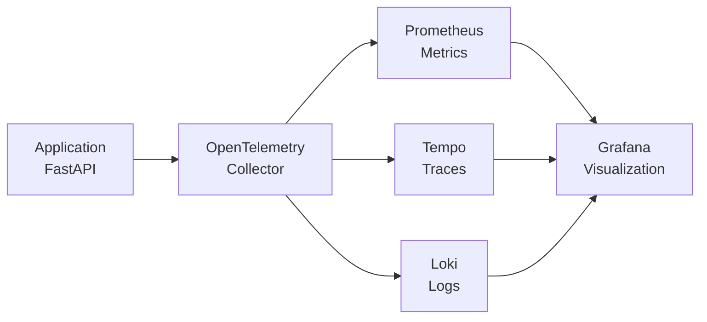

# OpenTelemetry MVP with Full Observability Stack

## General Overview

This project is an MVP (Minimum Viable Product) demonstrating OpenTelemetry integration with a full observability stack. It showcases how to instrument a FastAPI application to generate telemetry data (traces, metrics, and logs) and route it through an OpenTelemetry Collector to various backends for monitoring and visualization.

The stack includes:

- **Loki** for centralized logging
- **Grafana** for dashboards and visualization
- **Tempo** for distributed tracing
- **Prometheus** for metrics collection

The core application is a FastAPI service that generates sample telemetry data, simulating real-world observability scenarios.

## High-Level Design Document

### Architecture Overview

The system follows a microservices architecture with the following components:

- **Application (FastAPI)**: The main service instrumented with OpenTelemetry for automatic generation of traces, metrics, and logs
- **OpenTelemetry Collector**: Receives OTLP (OpenTelemetry Protocol) data from the application and routes it to appropriate backends
- **Backends**:
  - **Prometheus**: Stores and serves metrics data
  - **Tempo**: Stores and queries distributed traces
  - **Loki**: Aggregates and indexes log data
- **Visualization**: Grafana provides unified dashboards for all telemetry data
- **Load Generator**: A separate service that simulates traffic to the FastAPI application

### Data Flow



1. The FastAPI application generates telemetry data through OpenTelemetry instrumentation
2. Data is sent via OTLP to the OpenTelemetry Collector
3. The Collector processes and routes data to respective backends
4. Grafana queries all backends to create comprehensive dashboards

## Steps to Run Application

### Docker/Podman Compose

#### Prerequisites

- Docker and Docker Compose (or Podman and Podman Compose)
- Git

#### Steps to Run

This setup works with both Docker Compose and Podman Compose. Use `docker-compose` or `podman-compose` commands as appropriate for your environment.

1. **Clone the repository**:

   ```bash
   git clone <repository-url>
   cd otel-lgtm-mvp
   ```

2. **Configure environment variables (optional but recommended)**:

   Copy the sample configuration and edit it to suit your environment:

   ```bash
   cp .env.example .env
   ```

   Update the values in `.env` before starting the stack:

   - `GF_SECURITY_ADMIN_USER`: Admin username for Grafana. The example file
     uses `admin` for quick local testing. In production choose a unique,
     non-default username to minimize brute-force attacks.
   - `GF_SECURITY_ADMIN_PASSWORD`: Admin password for Grafana. Keep `admin`
     only for development demos. Always set a strong, unique password in
     production.
   - `GF_USERS_ALLOW_SIGN_UP`: Controls whether self-service user sign-up is
     allowed. Leave set to `false` for both development and production unless
     you intentionally want anyone with access to create an account.
   - `GF_AUTH_ANONYMOUS_ENABLED`: Enables anonymous (no login) dashboard
     access. Keeping it `true` simplifies demos and local exploration. Switch
     it to `false` in production unless the dashboards are meant for public
     viewing.
   - `GF_AUTH_ANONYMOUS_ORG_ROLE`: Role assigned to anonymous users. `Viewer`
     grants read-only access and is appropriate for development. In production
     you can keep `Viewer`, lower permissions, or disable anonymous access
     entirely depending on your security requirements.

3. **Start the services**:

   ```bash
   docker-compose up -d
   # or
   podman-compose up -d
   ```

4. **Access the services**:

   - **Grafana Dashboard**: http://localhost:3000 (default credentials: admin/admin)
   - **FastAPI Application**: http://localhost:8000
   - **Prometheus**: http://localhost:9090
   - **Tempo**: http://localhost:3200
   - **Loki**: http://localhost:3100

5. **View telemetry data**:

   - Open Grafana and explore the pre-configured dashboard
   - Check application logs and metrics in their respective interfaces

6. **Stop the services**:
   ```bash
   docker-compose down
   # or
   podman-compose down
   ```

### Kubernetes via Kustomize

The repository also provides a Kubernetes deployment that mirrors the compose stack. All manifests live under `k8s/` and are structured as a reusable base plus environment-specific overlays.

#### Directory layout

- `k8s/base` – Deployments, Services, PersistentVolumeClaims, ConfigMaps, and the `grafana-admin` Secret that together stand up Grafana, Loki, Tempo, Prometheus, the OpenTelemetry Collector, the FastAPI app, and the load generator.
- `k8s/base/files` – Checked-in copies of the configuration files used by compose. Keep these files in sync with the originals when you change Loki/Tempo/Prometheus/Grafana settings.
- `k8s/overlays/local` – Targets local development clusters. It swaps the app/load generator images to the locally built tags and disables image pulls, making it ideal for `kind`, `k3d`, or Minikube.
- `k8s/overlays/production` – Provides templates for cloud clusters. It adds resource requests/limits, sets a sample storage class, promotes Grafana to a `LoadBalancer` Service, and defines placeholder Ingress objects for TLS termination.
- `docs/k8s-manifests.md` – Deep dive into every manifest with links back to the official Kubernetes documentation for further reading.

#### Managing Grafana credentials

The base manifest generates a `grafana-admin` Secret with the same admin/admin defaults as compose. Before deploying to a shared environment, replace it:

```bash
kubectl create secret generic grafana-admin \
  --namespace observability \
  --from-literal=GF_SECURITY_ADMIN_USER=your-admin \
  --from-literal=GF_SECURITY_ADMIN_PASSWORD='strong-password' \
  --dry-run=client -o yaml | kubectl apply -f -
```

You can also use `kustomize edit set secret --disable-name-suffix-hash grafana-admin ...` inside an overlay if you prefer the Secret to be managed declaratively.

#### macOS quickstart (kind + Docker Desktop or Podman)

These steps were tested end-to-end on a macOS host using `kind` v0.26.0 and Podman 5.5.2. Substitute Docker Desktop if that is your preferred container runtime.

1. **Install prerequisites**
   - [kubectl](https://kubernetes.io/docs/tasks/tools/install-kubectl-macos/) for cluster interaction.
   - [kind](https://kind.sigs.k8s.io/docs/user/quick-start/#installation) to provision a local Kubernetes cluster in containers.
   - Either [Docker Desktop](https://docs.docker.com/desktop/install/mac-install/) or [Podman Desktop](https://podman.io/docs/installation#macos) as the container engine. When using Podman, make sure `podman machine` is running (`podman machine start`).

2. **Clone the repository and move into it**

   ```bash
   git clone https://github.com/hyzhak/otel-lgtm-mvp.git
   cd otel-lgtm-mvp
   ```

3. **Build the demo images**

   ```bash
   # Docker Desktop
   docker build -t space-app:latest app
   docker build -t loadgen:latest loadgen

   # Podman (tested)
   podman build -t space-app:latest app
   podman build -t loadgen:latest loadgen
   ```

4. **Create the kind cluster**

   ```bash
   # Docker Desktop
   kind create cluster --name otel-lgtm --wait 2m

   # Podman provider
   KIND_EXPERIMENTAL_PROVIDER=podman kind create cluster --name otel-lgtm --wait 2m
   ```

5. **Load the local images into the cluster**
   - Docker Desktop can load images directly:

     ```bash
     kind load docker-image space-app:latest --name otel-lgtm
     kind load docker-image loadgen:latest --name otel-lgtm
     ```

   - With Podman, tag the images for the Docker registry namespace and import an archive (workaround documented in the [kind Podman guide](https://kind.sigs.k8s.io/docs/user/rootless/)):

     ```bash
     podman tag space-app:latest docker.io/library/space-app:latest
     podman tag loadgen:latest docker.io/library/loadgen:latest
     podman save --format docker-archive -o space-app.tar docker.io/library/space-app:latest
     podman save --format docker-archive -o loadgen.tar docker.io/library/loadgen:latest
     KIND_EXPERIMENTAL_PROVIDER=podman kind load image-archive space-app.tar --name otel-lgtm
     KIND_EXPERIMENTAL_PROVIDER=podman kind load image-archive loadgen.tar --name otel-lgtm
     ```

6. **Deploy the stack**

   ```bash
   make k8s-apply-local
   kubectl wait --namespace observability --for=condition=Available deployment --all --timeout=5m
   ```

7. **Access the services**
   - Forward ports from the cluster and open the dashboards locally:

     ```bash
     kubectl port-forward -n observability svc/grafana 3000:3000
     kubectl port-forward -n observability svc/space-app 8000:8000
     ```

   - Visit `http://localhost:3000` (Grafana) and `http://localhost:8000` (FastAPI). You can also run `open http://localhost:3000` on macOS.

8. **Clean up**

   ```bash
   make k8s-delete-local
   # Docker Desktop
   kind delete cluster --name otel-lgtm
   # Podman provider
   KIND_EXPERIMENTAL_PROVIDER=podman kind delete cluster --name otel-lgtm
   rm -f space-app.tar loadgen.tar  # remove the temporary archives if you created them
   ```

#### Local clusters (kind, k3d, Minikube)

1. Install `kubectl` and a local Kubernetes distribution (`kind`, `k3d`, or `minikube`).
2. Build the application images and tag them as expected by the overlay:

   ```bash
   docker build -t space-app:latest app
   docker build -t loadgen:latest loadgen
   ```

3. Load the images into your cluster (examples shown for `kind` and Minikube):

   ```bash
   kind load docker-image space-app:latest
   kind load docker-image loadgen:latest
   # or for Minikube
   minikube image load space-app:latest
   minikube image load loadgen:latest
   ```

4. Apply the manifests:

   ```bash
   make k8s-apply-local
   # equivalent to: kubectl apply -k k8s/overlays/local
   ```

5. Wait for workloads to become ready:

   ```bash
   kubectl get pods -n observability
   ```

6. Port-forward to reach the services from your workstation:

   ```bash
   kubectl port-forward -n observability svc/grafana 3000:3000
   kubectl port-forward -n observability svc/space-app 8000:8000
   kubectl port-forward -n observability svc/prometheus 9090:9090
   ```

7. Tear the stack down when finished:

   ```bash
   make k8s-delete-local
   ```

#### Production and cloud clusters (GKE, EKS, AKS, bare metal)

1. Copy `k8s/overlays/production` and adjust it to match your infrastructure:
   - Update `patches/storage-class.yaml` with the correct `storageClassName` for your cluster.
   - Swap the annotations in `patches/grafana-service.yaml` for the load balancer you use (AWS, GCP, MetalLB, etc.).
   - Edit `ingress.yaml` with the hostnames/TLS secrets that your ingress controller expects.
   - Override the container images to point at the registry where you publish the FastAPI app and load generator (for example via `kustomize edit set image`).
2. Rotate the Grafana admin credentials as shown above or manage them through your preferred secret store.
3. Deploy with:

   ```bash
   make k8s-apply-production
   # or: kubectl apply -k k8s/overlays/production
   ```

4. Integrate the overlay with GitOps or CI pipelines as needed. The manifests are compatible with both `kubectl` and Argo CD/Flux.

To clean up the production overlay from a cluster, run `make k8s-delete-production`.

#### Helpful commands

- Preview the rendered manifests before applying:

  ```bash
  kubectl kustomize k8s/overlays/local | less
  kubectl kustomize k8s/overlays/production | less
  ```

- Check the health of the running stack:

  ```bash
  kubectl get pods,svc,pvc -n observability
  kubectl logs -n observability deploy/otelcol
  ```

If you change any of the configuration files under `grafana/`, `otel-collector/`, `tempo/`, `loki/`, or `prometheus/`, copy the edits into `k8s/base/files` to keep the Kubernetes ConfigMaps aligned with the compose setup.

## Additional Notes

- The load generator service will automatically start generating traffic to the FastAPI application
- All services are configured to work together out of the box
- Configuration files for each service are located in their respective directories

## Integration Tests

These end-to-end tests bring up the full docker-compose stack, exercise the FastAPI demo service, and assert that traces, metrics, and logs flow into Tempo, Prometheus, and Loki respectively.

### Quick start

```bash
docker compose -f docker-compose.yml -f docker-compose.integration.yml up --build --exit-code-from integration-tests integration-tests
docker compose -f docker-compose.yml -f docker-compose.integration.yml down -v
```

Using `make integration-test` wraps the same commands (set `COMPOSE=podman-compose` to run them with Podman Compose instead of Docker Compose).

For Podman Compose you can run the equivalent flow:

```bash
podman-compose down -v && podman-compose up -d --build
# give services a brief moment to settle
sleep 4
podman-compose -f docker-compose.yml -f docker-compose.integration.yml run --rm integration-tests
```

The test suite will:
- run inside a disposable Python 3.12 container built from `tests/integration/Dockerfile` (dependencies baked into the image),
- wait for Grafana, Loki, Tempo, Prometheus, and the demo app to report healthy,
- generate sample traffic against the FastAPI app, and
- query each backend to ensure telemetry is ingested and queryable.

Set `STACK_READY_TIMEOUT` or `OBS_WAIT_TIMEOUT` (environment variables passed to the test container) to tweak readiness and observation timeouts when running on slower hardware.

If you need to run the assertions against an already running stack outside of Docker Compose, override the base URLs (e.g. `APP_BASE_URL`, `GRAFANA_HEALTH_URL`) when invoking the workflow so the test container targets the correct hosts.

Additional environment variables let you align the assertions with custom deployments (for example, when the service name or Loki label differs from `space-app`). Override `SERVICE_NAME`, `APP_HOST`, `PROM_EXPECTED_JOB`, or `LOKI_SERVICE_LABEL` as needed.

When changing `tests/requirements-dev.txt`, rebuild the integration image with `docker compose -f docker-compose.yml -f docker-compose.integration.yml build integration-tests` (or the equivalent `podman-compose build`).

The GitHub Actions workflow `.github/workflows/integration-tests.yml` runs the same compose stack on every push and pull request.
