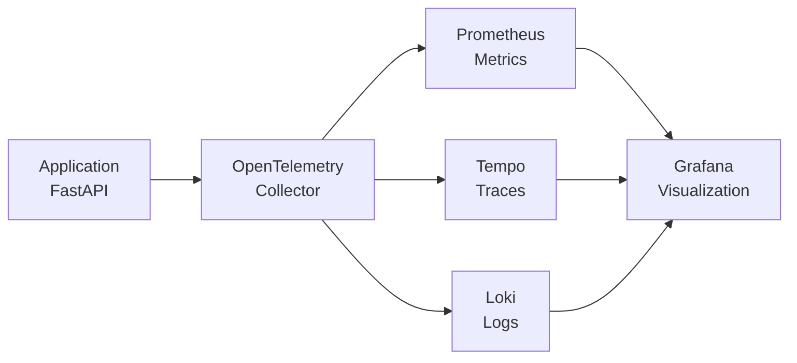

# OpenTelemetry MVP with Full Observability Stack

## General Overview

This project is an MVP (Minimum Viable Product) demonstrating OpenTelemetry integration with a full observability stack. It showcases how to instrument a FastAPI application to generate telemetry data (traces, metrics, and logs) and route it through an OpenTelemetry Collector to various backends for monitoring and visualization.

The stack includes:

- **Loki** for centralized logging
- **Grafana** for dashboards and visualization
- **Tempo** for distributed tracing
- **Prometheus** for metrics collection

The core application is a FastAPI service that generates sample telemetry data, simulating real-world observability scenarios.

## High-Level Design Document

### Architecture Overview

The system follows a microservices architecture with the following components:

- **Application (FastAPI)**: The main service instrumented with OpenTelemetry for automatic generation of traces, metrics, and logs
- **OpenTelemetry Collector**: Receives OTLP (OpenTelemetry Protocol) data from the application and routes it to appropriate backends
- **Backends**:
  - **Prometheus**: Stores and serves metrics data
  - **Tempo**: Stores and queries distributed traces
  - **Loki**: Aggregates and indexes log data
- **Visualization**: Grafana provides unified dashboards for all telemetry data
- **Load Generator**: A separate service that simulates traffic to the FastAPI application

### Data Flow



1. The FastAPI application generates telemetry data through OpenTelemetry instrumentation
2. Data is sent via OTLP to the OpenTelemetry Collector
3. The Collector processes and routes data to respective backends
4. Grafana queries all backends to create comprehensive dashboards

## Steps to Run Application

### Prerequisites

- Docker and Docker Compose (or Podman and Podman Compose)
- Git

### Steps to Run

This setup works with both Docker Compose and Podman Compose. Use `docker-compose` or `podman-compose` commands as appropriate for your environment.

1. **Clone the repository**:

   ```bash
   git clone <repository-url>
   cd otel-lgtm-mvp
   ```

2. **Start the services**:

   ```bash
   docker-compose up -d
   # or
   podman-compose up -d
   ```

3. **Access the services**:

   - **Grafana Dashboard**: http://localhost:3000 (default credentials: admin/admin)
   - **FastAPI Application**: http://localhost:8000
   - **Prometheus**: http://localhost:9090
   - **Tempo**: http://localhost:3200
   - **Loki**: http://localhost:3100

4. **View telemetry data**:

   - Open Grafana and explore the pre-configured dashboard
   - Check application logs and metrics in their respective interfaces

5. **Stop the services**:
   ```bash
   docker-compose down
   # or
   podman-compose down
   ```

## Additional Notes

- The load generator service will automatically start generating traffic to the FastAPI application
- All services are configured to work together out of the box
- Configuration files for each service are located in their respective directories
