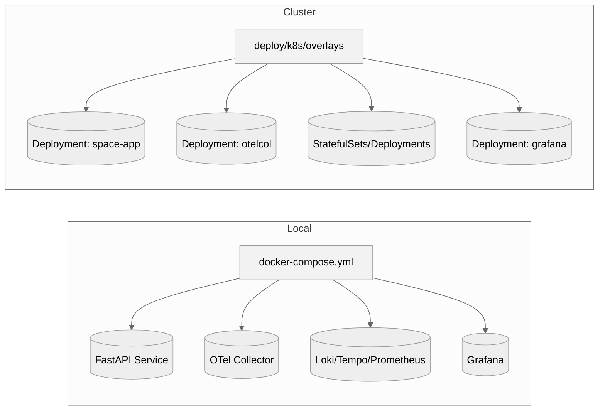
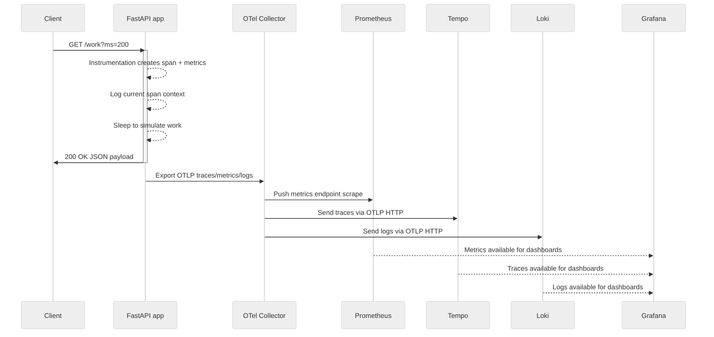

# High-Level Design

This document captures the target architecture for the OpenTelemetry MVP stack and explains how the components collaborate to deliver an end-to-end observability experience across traces, metrics, and logs.

## System Context

The solution centers on an instrumented FastAPI application that emits OpenTelemetry signals. The OpenTelemetry Collector acts as a control point, accepting traffic from the app and forwarding it to dedicated backends—Prometheus, Tempo, and Loki—while Grafana offers a unified visualization interface.

```mermaid
%%{init: {"theme": "neutral"}}%%
usecaseDiagram
  actor User as Developer
  actor "Synthetic Client" as LoadGen
  rectangle "Observability MVP" {
    (Inspect dashboards) as Inspect
    (Trigger application endpoints) as Invoke
    (Generate background traffic) as Traffic
    (Collect OTLP signals) as Collect
    (Persist metrics) as Metrics
    (Persist traces) as Traces
    (Persist logs) as Logs
    (Render dashboards) as Visualize
  }
  Developer --> Inspect
  Developer --> Invoke
  LoadGen --> Traffic
  Invoke --> Collect
  Traffic --> Collect
  Collect --> Metrics
  Collect --> Traces
  Collect --> Logs
  Metrics --> Visualize
  Traces --> Visualize
  Logs --> Visualize
  Visualize --> Inspect
```

*Figure 1 – Use cases showing how developers and the synthetic load generator interact with the observability platform.*

## Logical Architecture

The system is composed of loosely coupled services, each responsible for a single aspect of the observability workflow. The instrumentation in `app/main.py` automatically produces spans, metrics, and logs. The OpenTelemetry Collector defined in `deploy/k8s/base/config/otel-collector/otelcol-config.yml` fans those signals out to the LGTM stack, and Grafana serves as the access point for exploration.

```mermaid
%%{init: {"theme": "neutral"}}%%
flowchart TB
  subgraph Client
    cli[Developer]
    loadgen[Load Generator]
  end
  subgraph AppTier[FastAPI Application]
    app[space-app]
  end
  subgraph Collector[OpenTelemetry Collector]
    otel[OTLP Receivers\n+ processors]
  end
  subgraph Observability[Loki-Tempo-Prometheus]
    loki[Loki\n(log storage)]
    tempo[Tempo\n(trace storage)]
    prom[Prometheus\n(metrics TSDB)]
  end
  grafana[ Grafana ]

  cli -->|HTTP| app
  loadgen -->|Synthetic requests| app
  app -->|OTLP/gRPC + HTTP| otel
  otel -->|Metrics| prom
  otel -->|Traces| tempo
  otel -->|Logs| loki
  prom --> grafana
  tempo --> grafana
  loki --> grafana
```

*Figure 2 – Component diagram summarizing the logical responsibilities and communication paths.*

## Deployment View

The deployment manifests in `deploy/k8s/base/*.yaml` and the Docker Compose definitions mirror one another, ensuring parity between local and cluster environments. Both topologies rely on shared configuration mounted from `deploy/k8s/base/config`. Persistent components (Loki and Prometheus) additionally require volumes in production environments to safeguard state.



*Figure 3 – Deployment parity between local Compose workflows and Kubernetes overlays.*

## Request Lifecycle

From an observability perspective, the most critical workflow involves a user request entering the system, traversing the collector, and becoming visible in dashboards. The following sequence diagram illustrates the flow for the `/work` endpoint, including metrics and logs captured along the way.



*Figure 4 – Sequence diagram for an instrumented request showing telemetry propagation.*

The instrumentation behavior and collector routing shown above are implemented in the FastAPI service and collector configuration files.【F:app/main.py†L21-L118】【F:deploy/k8s/base/config/otel-collector/otelcol-config.yml†L1-L38】 The load generator continuously exercises the API, ensuring the telemetry pipeline remains active for validation.【F:loadgen/loadgen.py†L1-L25】

## Data Management Considerations

- **Metrics** – Prometheus scrapes the collector’s `/metrics` endpoint at `0.0.0.0:8889`, as configured in the collector manifest, and stores samples in its local time-series database.【F:deploy/k8s/base/config/otel-collector/otelcol-config.yml†L20-L24】【F:deploy/k8s/base/config/otel-collector/otelcol-config.yml†L37-L40】
- **Traces** – Tempo accepts spans over OTLP HTTP, enabling Grafana Tempo data source queries without additional shims.【F:deploy/k8s/base/config/otel-collector/otelcol-config.yml†L26-L32】
- **Logs** – Loki ingests OTLP log payloads and indexes them for search, enabling trace-to-log correlations using shared trace IDs.【F:deploy/k8s/base/config/otel-collector/otelcol-config.yml†L32-L38】【F:app/main.py†L73-L118】

## Observability Features

- Automatic FastAPI instrumentation via `FastAPIInstrumentor.instrument_app` ensures route spans are created without manual boilerplate.【F:app/main.py†L60-L64】
- Structured logging includes trace and span IDs so Grafana Loki explorations can pivot between logs and traces.【F:app/main.py†L70-L118】
- Custom metrics counters and histograms quantify request volume and latency per route, enabling SLO dashboards in Grafana.【F:app/main.py†L46-L59】【F:app/main.py†L86-L109】

## Scalability and Extensibility

- **Collector pipelines** can be extended with additional processors/exporters for other telemetry backends by editing `otelcol-config.yml`, keeping application code untouched.【F:deploy/k8s/base/config/otel-collector/otelcol-config.yml†L1-L38】
- **Deployment overlays** (`deploy/k8s/overlays/*`) allow environment-specific tuning—resource limits, ingress, storage classes—without diverging from the base templates.
- **Load generation** via `loadgen/loadgen.py` offers a repeatable way to stress the stack and validate instrumentation during development or CI pipelines.【F:loadgen/loadgen.py†L1-L25】

## Testing Strategy

- Unit tests can target FastAPI route behavior (see `tests/`) while using the provided `docker-compose.integration.yml` or Kubernetes manifests for integration smoke tests.
- To validate observability, run the load generator alongside the stack and confirm telemetry ingestion in Grafana dashboards, Loki log streams, and Tempo trace views.

## Security and Operations

- Grafana credentials and anonymous access are configurable via environment variables (`GF_*`), which should be hardened in production deployments.【F:README.md†L44-L85】
- For shared clusters, replace placeholder secrets and configure persistent volumes for data-retaining services to avoid data loss across restarts.

## Future Improvements

- Introduce OpenTelemetry Collector tail-based sampling for trace volume management.
- Automate dashboard provisioning via Grafana JSON board definitions in `deploy/k8s/base/config/grafana`.
- Expand automated tests to verify telemetry content using the OTLP exporter test harness.
